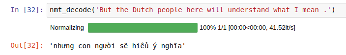

## Introduction
This project belongs to Udacity - Natural Language Processing Nano Degree, which is implementing Neural Machine Translation to translate English to French with Keras.
## Result
- Greedy decode

- Beam Decode
## Todo
- [x] Simple RNN Model
- [x] RNN with Embedding Layer
- [x] Bidirectional RNN Model
- [x] Encoder-Decoder model
- [x] Simple Attention
  - [x] Simple Attention
  - [x] Decreasing loss
  - [x] GPU Training
  - [x] Additive Attention
  - [x] Multiplicitive Attention
  - [x] Batch Training
  - [x] Variable-sized Input and Output (Easy but can't apply parallelism)
- [x] Transformer
  - [x] Encoder
  - [x] Decoder
  - [x] Inference
- [ ] Beam Search
